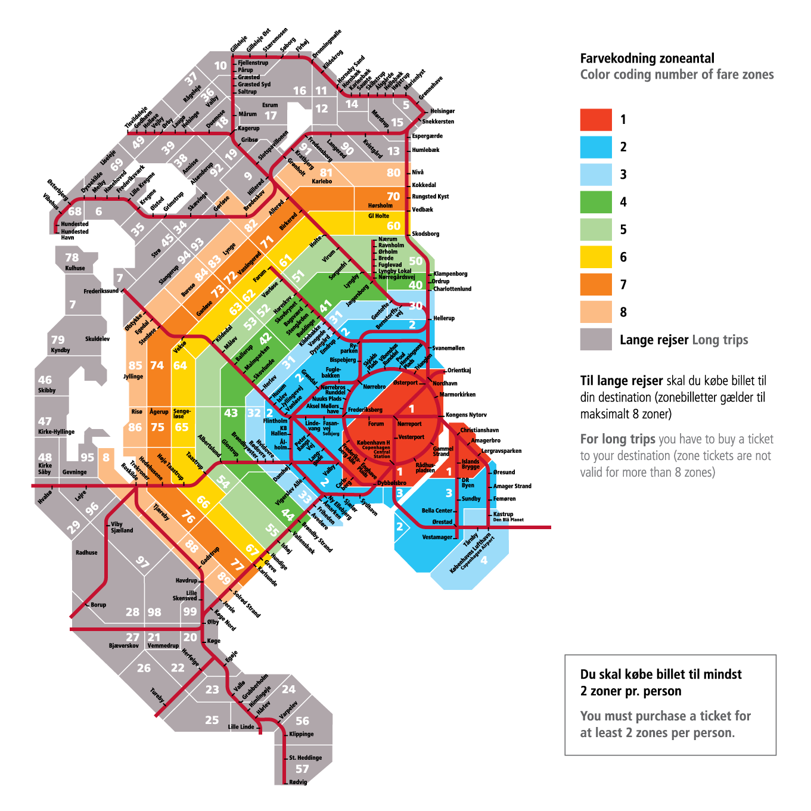

# BoligPortal Scraper
This is web scraper operating on Boligportal. It can massively and automatically extract useful information from potentially hundreds of URLs and saves the results. Subsequently, the user can apply a highly customizable filter to the scraped data and finely refine a list of listings which match within the specified selection criteria. 

## Background
This project was born out of a need to solve a real-world problem. As an expat in Copenhagen, I share the buirden my fellow outsiders, of periodically having to move. [Boligportal.dk](https://www.boligportal.dk/) is some sort of on-line marketplace where people and companies can post listings of their spaces which are up for rental. Altough the site offers some options in filtering through the homes, sometimes the filter does not seem to trim through the announcements quite strictly. Or, it's lacking many quality if life fields. Or its implementation just seems to fall short. 

Regardless, I find this task very time consuming to do manually, as I have to waste I believe an average of 2 minutes per listing, just to understand what I am looking at and if I should contact the landlord. Now, with this application, I was able to let the computer go through tenths of pages with a couple hundred of listing, in mere minutes...thanks to hours of coding. By applying the filtering, I end up with less than a handful of homes to go through. Now that's a time saver!

## Summary
This scraper will visit a main results page on the website. This will be given by you offering some basic search options to Boligportal. Subsequently, potentially tenths of pages of announcements might appear. Since we don't like to manually go through them and look at all the details, we can make our search as picky as possible. That way, we only get a handful of listings to then visit and send messages(or calls, by case) to ask for details or start negotiating.

## How to use 
You can run `python3 main.py --scrape` script to go to a search page, with whatever filters you want applied. E.g.: I want all apartments in Copenhagen, whose rent is below 15000kr per month and have at least 3 rooms. Subsequently, the script will proceed to scrape all lings to all ads and create a list of links to parse. In the next step, it visits each ad and extracts the information we want. It also does some processing such as translating the summaries from Danish to English using the code in `src/dependencies/google_trans_new`. Then, you can save your results to a CSV file. There are a few parameters which need to be set in the `config/scraper_config.json` file. You can run `python3 main.py --filter` with the configuration options in `config/filter_config.py`.

## Navigate Denmark's Housing Landscape
The following should help the user know how to pick their housing in Copenhagen, given the ZIP code information and the public transportation areas.
 

## Dependencies 
The code makes use of google_trans_new, which was cloned from their Github, into the folder `goog_trans` because it still has some errors. The code needed to be modified as [per this answer](https://stackoverflow.com/questions/68214591/python-google-trans-new-translate-raises-error-jsondecodeerror-extra-data) on StackOverflow i.e. change line 151 in `google_trans_new.py`. Additionally, the scraper makes use of BeautifulSoup.

## Notes from developer
The project is public and free to use. Please feel free to contribute to maintaining and expanding this project. If you would like to do so, give me a heads up by sending me a message or an e-mail. At the same time, if you decide to use this code, please offer a citation back to me. :)
